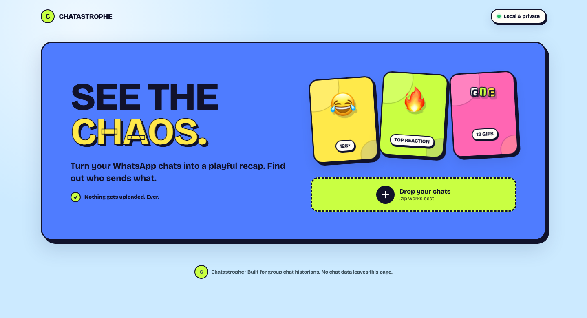

# Chatastrophe

**Turn your WhatsApp chats into a playful recap. Find out who sends what.**

Chatastrophe is a private, browser-based analyser for exported WhatsApp group chats. Drop in a chat export to explore the group's most-used stickers and GIFs, compare participant activity, and browse the media each person sent.

Message text is never displayed. The selected export is processed locally in the browser and is not uploaded to a server.

[**Try Chatastrophe →**](https://chatastrophe-rho.vercel.app/)



## Features

- A sticker board featuring the eight most-used stickers and GIFs
- A filterable participant scoreboard
- First-message, first-sticker, and first-GIF dates
- Per-participant galleries for stickers, GIFs, images, videos, voice notes, audio, and documents
- Duplicate stickers and GIFs consolidated with usage counts
- CSV summary downloads
- Responsive desktop and mobile layouts
- Support for common Android and iPhone export formats
- Local-only chat processing with no database or upload endpoint

## Privacy

Chatastrophe is designed so private chat data does not need to leave the device.

- ZIP extraction and transcript parsing happen in browser memory.
- Media previews use temporary browser-generated object URLs.
- Message bodies are parsed only to identify senders and attachment records; they are never rendered.
- CSV reports are generated locally.
- Fonts are bundled with the application rather than requested from an external font service.
- Selecting a file does not make a network request containing the chat or its media.
- The deployed site uses Vercel Web Analytics for site-usage metrics; Chatastrophe does not pass selected files, chat contents, or media to it.

When deployed as a static website, the hosting provider serves the application files but does not receive the selected WhatsApp export through Chatastrophe.

## How to use it

For the most complete analysis:

1. Open the WhatsApp group on your phone or desktop
2. Open the group information or chat menu.
3. Select **Export chat**.
4. Choose **Include media**.
5. Save or transfer the resulting `.zip` file to the device running Chatastrophe.
6. Open Chatastrophe and select or drop the ZIP.

A text-only export can still provide message counts, but it may not preserve enough information to distinguish or preview every media type.

## Accuracy and limitations

WhatsApp does not publish one universal export format. Formatting can vary by operating system, locale, language, and application version.

- GIFs are frequently exported as MP4 files. They are recognized as GIFs when the export labels them accordingly; otherwise they may appear as videos.
- Generic “media omitted” entries are reported as unknown media instead of being guessed.
- A ZIP exported without media cannot provide actual sticker, GIF, image, or video previews.
- Some browsers cannot preview HEIC, OPUS, or other device-specific formats even when those files are correctly classified.
- Date parsing assumes day-first ordering when an otherwise ambiguous numeric date could be interpreted either way.
- WhatsApp export limits may mean the file does not contain the complete history of a very large chat.
- Participant names come from the exported transcript. Unsaved-contact markers are cleaned, and shared first names are expanded when enough name information is available.

## Local development

<details>
<summary><strong>Run Chatastrophe locally</strong></summary>

### Requirements

- Node.js 20 or newer is recommended
- npm
- A modern browser with support for ES modules, object URLs, and the Web Crypto API

### Installation

```bash
git clone <your-repository-url>
cd <your-repository-directory>
npm install
npm run dev
```

Open the URL printed by Vite, normally `http://localhost:5173`.

### Available commands

```bash
npm run dev      # Start the development server
npm test         # Run parser tests once
npm run build    # Create a production build in dist/
```

</details>

## How it works

```text
WhatsApp ZIP
    │
    ├── Transcript (.txt) ──> message parser ──> participant metrics
    │
    └── Media files ────────> classifier ──────> local previews
                                      │
                                      └────────> duplicate detection
```

1. [JSZip](https://stuk.github.io/jszip/) opens the selected ZIP in the browser.
2. The transcript parser recognizes common Android and iPhone message formats, including multiline messages.
3. Attachment filenames and transcript markers are used to classify media.
4. Stickers and GIFs are fingerprinted locally with SHA-256 so repeated files can be consolidated.
5. Metrics and galleries are rendered without displaying message text.

The main parser is in `src/parser.js`; application behavior is in `src/main.js`; and the responsive visual system is in `src/style.css`.

### Media classification


| Category   | Common export indicators                              |
| ---------- | ----------------------------------------------------- |
| Sticker    | `.webp`, `STK-`, or `STICKER-` filenames              |
| GIF        | `.gif`, `GIF-` filenames, or GIF transcript markers   |
| Image      | `.jpg`, `.jpeg`, `.png`, `.heic`, `IMG-`, or `PHOTO-` |
| Video      | `.mp4`, `.mov`, `.3gp`, or `VID-`                     |
| Voice note | `PTT-` or voice-note transcript markers               |
| Audio      | `.opus`, `.ogg`, `.m4a`, `.mp3`, `.wav`, or `AUD-`    |
| Document   | PDF, Word, Excel, PowerPoint, and ZIP attachments     |


## Testing

The test suite covers common transcript formats, multiline messages, attachment classification, ambiguous media, and participant-name normalization.

```bash
npm test
```

Before deploying a change, run:

```bash
npm test
npm run build
```

When adding support for another export format, use anonymized transcript fixtures and avoid committing private chat exports or media.

## Technology

- Vanilla JavaScript and CSS
- [Vite](https://vite.dev/) for development and builds
- [JSZip](https://stuk.github.io/jszip/) for browser-side ZIP processing
- [Vitest](https://vitest.dev/) for tests
- Self-hosted Bricolage Grotesque variable font

## Deployment

Chatastrophe is a static application, so the production `dist/` directory can be hosted on GitHub Pages, Netlify, Cloudflare Pages, or a similar service.

For a GitHub project page, build with the repository path as Vite's base path:

```bash
npm run build -- --base=/your-repository-name/
```

For a user or organization page served at the domain root, use:

```bash
npm run build -- --base=/
```

Publish the generated `dist/` directory using a GitHub Pages workflow or another static-hosting deployment process. Replace `your-repository-name` with the actual repository name.

## Contributing

Contributions are welcome, particularly for:

- Additional WhatsApp export formats and locales
- Anonymized parser fixtures
- Media-classification improvements
- Accessibility and browser compatibility
- Performance improvements for large exports

Please avoid committing real chat transcripts, phone numbers, participant names, or private media. Use synthetic or thoroughly anonymized fixtures in tests and bug reports.

## License

An open-source license has not been selected yet. Add a `LICENSE` file before inviting others to reuse, modify, or redistribute the project.

## Project status

Chatastrophe is an early-stage project. Treat its output as a playful recap rather than an authoritative archive or compliance report.
